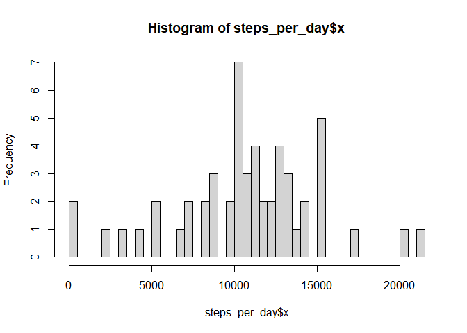
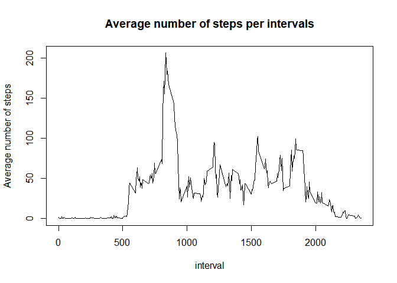
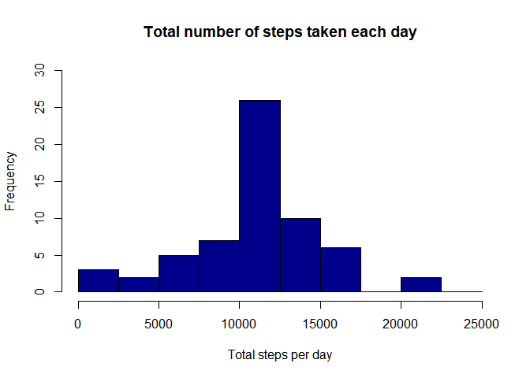
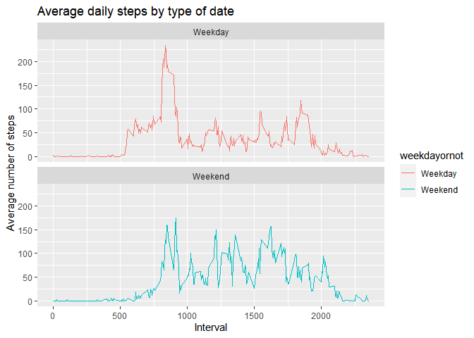

## Loading and preprocessing the data

```r
data <- read.csv(unz("activity.zip", "activity.csv"))
```


## What is mean total number of steps taken per day?
Total number of steps taken per day is:

```r
library(tidyverse)
```

```
## -- Attaching packages --------------------------------------- tidyverse 1.3.0 --
```

```
## v ggplot2 3.3.3     v purrr   0.3.4
## v tibble  3.0.5     v dplyr   1.0.3
## v tidyr   1.1.2     v stringr 1.4.0
## v readr   1.4.0     v forcats 0.5.1
```

```
## Warning: package 'stringr' was built under R version 4.0.4
```

```
## -- Conflicts ------------------------------------------ tidyverse_conflicts() --
## x dplyr::filter() masks stats::filter()
## x dplyr::lag()    masks stats::lag()
```

```r
steps_per_day <- aggregate(data$steps, by=list(date=data$date), FUN=sum)
steps_per_day
```

```
##          date     x
## 1  2012-10-01    NA
## 2  2012-10-02   126
## 3  2012-10-03 11352
## 4  2012-10-04 12116
## 5  2012-10-05 13294
## 6  2012-10-06 15420
## 7  2012-10-07 11015
## 8  2012-10-08    NA
## 9  2012-10-09 12811
## 10 2012-10-10  9900
## 11 2012-10-11 10304
## 12 2012-10-12 17382
## 13 2012-10-13 12426
## 14 2012-10-14 15098
## 15 2012-10-15 10139
## 16 2012-10-16 15084
## 17 2012-10-17 13452
## 18 2012-10-18 10056
## 19 2012-10-19 11829
## 20 2012-10-20 10395
## 21 2012-10-21  8821
## 22 2012-10-22 13460
## 23 2012-10-23  8918
## 24 2012-10-24  8355
## 25 2012-10-25  2492
## 26 2012-10-26  6778
## 27 2012-10-27 10119
## 28 2012-10-28 11458
## 29 2012-10-29  5018
## 30 2012-10-30  9819
## 31 2012-10-31 15414
## 32 2012-11-01    NA
## 33 2012-11-02 10600
## 34 2012-11-03 10571
## 35 2012-11-04    NA
## 36 2012-11-05 10439
## 37 2012-11-06  8334
## 38 2012-11-07 12883
## 39 2012-11-08  3219
## 40 2012-11-09    NA
## 41 2012-11-10    NA
## 42 2012-11-11 12608
## 43 2012-11-12 10765
## 44 2012-11-13  7336
## 45 2012-11-14    NA
## 46 2012-11-15    41
## 47 2012-11-16  5441
## 48 2012-11-17 14339
## 49 2012-11-18 15110
## 50 2012-11-19  8841
## 51 2012-11-20  4472
## 52 2012-11-21 12787
## 53 2012-11-22 20427
## 54 2012-11-23 21194
## 55 2012-11-24 14478
## 56 2012-11-25 11834
## 57 2012-11-26 11162
## 58 2012-11-27 13646
## 59 2012-11-28 10183
## 60 2012-11-29  7047
## 61 2012-11-30    NA
```
histogram of the total number of steps taken each day:

```r
hist(steps_per_day$x, breaks = 50)
```

<!-- -->

The mean and median of the total number of steps taken per day is:


```r
paste("Mean =", round(mean(steps_per_day$x, na.rm = T), 2), "and median =", median(steps_per_day$x, na.rm = T))
```

```
## [1] "Mean = 10766.19 and median = 10765"
```

## What is the average daily activity pattern?
Time series plot of the 5-minute interval (x-axis) and the average number of steps taken, averaged across all days (y-axis):

```r
steps_per_interval <- aggregate(data$steps, by=list(interval=data$interval), FUN=mean, na.rm = T)
plot(steps_per_interval, type = "l", ylab="Average number of steps", main="Average number of steps per intervals")
```

<!-- -->

Which 5-minute interval, on average across all the days in the dataset, contains the maximum number of steps? The answer is:


```r
arrange(steps_per_interval, desc(x))[1,]
```

```
##   interval        x
## 1      835 206.1698
```


## Imputing missing values
The total number of missing values in the dataset is:

```r
sum(is.na(data$steps))
```

```
## [1] 2304
```
Strategy for filling in all of the missing values in the dataset and assign it to a new variable.

```r
imputed_steps <- steps_per_interval$x[match(data$interval, steps_per_interval$interval)]
```

Create a new dataset that is equal to the original dataset but with the missing data filled in.

```r
activity_imputed <- transform(data, steps = ifelse(is.na(data$steps), yes = imputed_steps, no = data$steps))
total_steps_imputed <- aggregate(steps ~ date, activity_imputed, sum)
names(total_steps_imputed) <- c("date", "daily_steps")
```


Make a histogram of the total number of steps taken each day and Calculate and report the mean and median total number of steps taken per day. Do these values differ from the estimates from the first part of the assignment? What is the impact of imputing missing data on the estimates of the total daily number of steps?

```r
hist(total_steps_imputed$daily_steps, col = "darkblue", xlab = "Total steps per day", ylim = c(0,30), main = "Total number of steps taken each day", breaks = seq(0,25000,by=2500))
```

<!-- -->


We can see that mean and median have changed.


## Are there differences in activity patterns between weekdays and weekends?

Create a new factor variable in the dataset with two levels – “weekday” and “weekend” indicating whether a given date is a weekday or weekend day.

```r
library(chron)
```

```
## Warning: package 'chron' was built under R version 4.0.5
```

```r
data$date <- as.Date(data$date, "%Y-%m-%d")
data <- data %>% mutate(weekdayornot = ifelse(is.weekend(data$date) == FALSE, "Weekday", "Weekend"))
```


Make a panel plot containing a time series plot (i.e. \color{red}{\verb|type = "l"|}type = "l") of the 5-minute interval (x-axis) and the average number of steps taken, averaged across all weekday days or weekend days (y-axis). See the README file in the GitHub repository to see an example of what this plot should look like using simulated data.


```r
activity_by_date <- aggregate(steps~interval + weekdayornot, data=data, FUN=mean, na.rm = T)
ggplot(activity_by_date, 
       aes(x = interval, 
           y = steps, 
           color = weekdayornot)
       ) + geom_line() + 
  labs(title = "Average daily steps by type of date", 
       x = "Interval", 
       y = "Average number of steps") + 
  facet_wrap(~weekdayornot, ncol = 1, nrow=2)
```

<!-- -->
